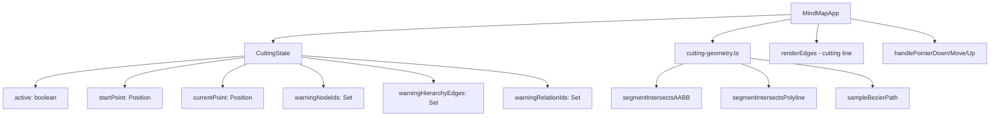
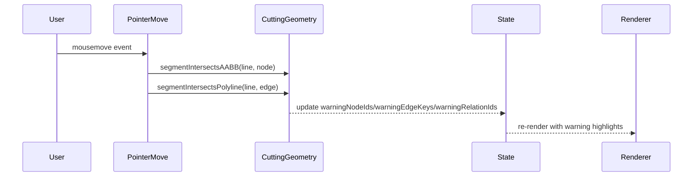

# Design Document: Edge Cutting (切除功能)

## Overview

切除功能允许用户通过在画布空白处按下右键并拖动来产生一条切除线，实时检测与节点/连线的相交，松开右键时原子性执行删除操作。该功能参考 Project Graph 的 ControllerCutting 实现，适配 Code Mind 的 DOM+SVG 渲染架构和现有交互模式。

### 核心交互流程

1. 用户在画布空白处按下右键 → 进入切除模式，记录起点
2. 拖动鼠标 → 实时渲染切除线，检测相交对象，高亮警告
3. 松开右键 → 原子性执行所有切除操作，推送历史快照，退出切除模式

### 设计决策

| 决策 | 选择 | 理由 |
|------|------|------|
| 切除模式触发 | 右键在空白区域按下即进入 | 与现有 `canvasRightDragAction` 设置集成，新增 `'cutting'` 选项 |
| 切除线渲染层 | SVG edge layer | 复用现有 `edgeLayer` SVG 元素，与连线同层渲染 |
| Bézier 相交检测 | 采样为 polyline (16段) | 精度足够且性能可控，参考 Project Graph 做法 |
| 节点相交检测 | 线段 vs AABB 矩形 | 节点为矩形 DOM 元素，AABB 检测最高效 |
| 操作执行顺序 | Relations → Hierarchy Edges → Nodes | 先删关系线避免悬挂引用，再断层级，最后删节点并提升子节点 |
| 历史记录 | 单次 snapshot | 无论切除多少对象，只产生一个撤销点 |

## Architecture

### 模块划分



### 集成方式

切除模式作为一种新的 canvas drag action 集成到现有交互系统中：

1. **类型扩展**: `CanvasDragAction` 新增 `'cutting'` 值
2. **状态扩展**: `AppState` 新增 `cutting: CuttingState | null` 字段
3. **事件处理**: 在 `handlePointerDown` → `startCanvasDragAction` 中新增 `'cutting'` 分支
4. **渲染集成**: 在 `renderEdges()` 末尾追加切除线 SVG 和高亮样式

## Components and Interfaces

### CuttingState (新增到 app-types.ts)

```typescript
export interface CuttingState {
  /** Pointer ID for tracking */
  pointerId: number
  /** Cutting line start point in canvas coordinates */
  startPoint: Position
  /** Cutting line current endpoint in canvas coordinates */
  currentPoint: Position
  /** Node IDs currently intersected by cutting line */
  warningNodeIds: Set<string>
  /** Hierarchy edge keys (parentId-childId) currently intersected */
  warningHierarchyEdgeKeys: Set<string>
  /** Relation edge IDs currently intersected */
  warningRelationIds: Set<string>
}
```

### cutting-geometry.ts (新文件)

```typescript
import type { Position } from './types'

/**
 * 检测线段 AB 是否与轴对齐矩形 (AABB) 相交
 * 使用 Cohen-Sutherland 或参数化裁剪算法
 */
export function segmentIntersectsAABB(
  a: Position, b: Position,
  rectCenter: Position, rectWidth: number, rectHeight: number
): boolean

/**
 * 检测线段 AB 是否与折线 (polyline) 的任意一段相交
 */
export function segmentIntersectsPolyline(
  a: Position, b: Position,
  polyline: Position[]
): boolean

/**
 * 检测两条线段是否相交
 */
export function segmentsIntersect(
  p1: Position, p2: Position,
  p3: Position, p4: Position
): boolean

/**
 * 将 SVG cubic Bézier path 采样为折线点序列
 * @param segments 采样段数，默认 16
 */
export function sampleCubicBezier(
  p0: Position, cp1: Position, cp2: Position, p3: Position,
  segments?: number
): Position[]

/**
 * 解析 SVG path d 属性中的 cubic Bézier (M...C...) 为控制点
 */
export function parseCubicBezierFromPath(d: string): {
  start: Position
  cp1: Position
  cp2: Position
  end: Position
} | null
```

### CanvasDragAction 类型扩展

```typescript
// types.ts
export type CanvasDragAction = 'none' | 'pan-canvas' | 'marquee-select' | 'cutting'
```

### 交互设置默认值

```typescript
// preferences.ts - canvasRightDragAction 默认值改为 'cutting'
// 用户可在设置面板中切换回 'pan-canvas' 或 'marquee-select'
```

### 核心方法 (MindMapApp 类内)

```typescript
// 进入切除模式
private startCuttingMode(pointerId: number, clientX: number, clientY: number): void

// 更新切除线并重新计算相交
private updateCuttingLine(clientX: number, clientY: number): void

// 执行切除操作
private executeCutting(): void

// 取消切除模式（鼠标离开窗口时）
private cancelCutting(): void

// 渲染切除线 SVG
private renderCuttingLine(): string
```

## Data Models

### 状态变更

切除操作不引入新的持久化数据模型，仅修改现有文档结构：

| 操作 | 数据变更 |
|------|----------|
| 切除 Hierarchy Edge | `child.kind = 'floating'`, `child.parentId = undefined` |
| 切除 Relation Edge | 从 `document.relations` 数组中移除该 RelationEdge |
| 切除 Topic Node | 从 `document.nodes` 中移除节点，子节点 `parentId` 改为被删节点的 `parentId` |
| 切除 Floating Node | 从 `document.nodes` 中移除节点 |

### 执行顺序保证

```typescript
interface CuttingExecution {
  // Phase 1: 删除 Relation Edges
  relationIdsToDelete: string[]
  // Phase 2: 断开 Hierarchy Edges (子节点变 floating)
  hierarchyEdgesToSever: Array<{ parentId: string; childId: string }>
  // Phase 3: 删除 Nodes (带子节点提升)
  nodeIdsToDelete: string[]
  // 快照：执行前捕获的原始 parentId 映射
  originalParentIds: Map<string, string | undefined>
}
```

### Warning List 数据流



## Correctness Properties

*A property is a characteristic or behavior that should hold true across all valid executions of a system—essentially, a formal statement about what the system should do. Properties serve as the bridge between human-readable specifications and machine-verifiable correctness guarantees.*

### Property 1: Line-segment vs AABB intersection correctness

*For any* line segment defined by two points A and B, and *for any* axis-aligned bounding box defined by center, width, and height, `segmentIntersectsAABB(A, B, center, width, height)` shall return true if and only if the line segment actually crosses or touches the rectangle boundary or interior.

**Validates: Requirements 3.1**

### Property 2: Line-segment vs polyline intersection correctness

*For any* line segment defined by two points A and B, and *for any* polyline defined by a sequence of vertices, `segmentIntersectsPolyline(A, B, polyline)` shall return true if and only if the line segment intersects at least one segment of the polyline.

**Validates: Requirements 4.1, 4.2**

### Property 3: Bézier sampling fidelity

*For any* cubic Bézier curve defined by four control points (P0, CP1, CP2, P3), every point in the sampled polyline returned by `sampleCubicBezier(P0, CP1, CP2, P3, n)` shall lie on the actual Bézier curve (within floating-point tolerance), and the first point shall equal P0 and the last point shall equal P3.

**Validates: Requirements 4.5**

### Property 4: Hierarchy edge severing preserves invariants

*For any* valid document containing a parent-child hierarchy edge, when that edge is severed by the cutting operation, the child node's kind shall become `'floating'`, its parentId shall be cleared, its position and dimensions shall remain identical to their pre-cut values, and the parent node and all other sibling nodes shall remain completely unchanged.

**Validates: Requirements 6.1, 6.2, 6.3**

### Property 5: Relation edge deletion preserves node invariants

*For any* valid document containing a relation edge, when that relation is deleted by the cutting operation, the relation shall no longer exist in `document.relations`, and both the source node and target node shall retain their original kind, position, dimensions, and all other properties unchanged.

**Validates: Requirements 7.1, 7.2**

### Property 6: Node deletion with child promotion

*For any* valid document containing a topic node with zero or more children, when that node is deleted by the cutting operation: (a) the node shall be removed from `document.nodes`, (b) each direct child of the deleted node shall have its parentId reassigned to the deleted node's original parentId, (c) promoted children shall retain their original positions and dimensions, and (d) if multiple nodes in a chain are deleted in the same stroke, child promotion shall use the original parentId values captured before any deletions.

**Validates: Requirements 8.1, 8.2, 8.3, 11.3**

### Property 7: Cut-then-undo round trip

*For any* valid document state and *for any* non-empty set of cutting targets, executing the cutting operation and then immediately triggering undo shall restore the document to a state identical to the pre-cut state (all nodes, relations, positions, and properties match).

**Validates: Requirements 10.1, 10.2**

### Property 8: Atomic history — single snapshot per stroke

*For any* cutting stroke that affects one or more objects (any combination of nodes, hierarchy edges, and relation edges), the history stack shall grow by exactly one entry, regardless of how many objects were cut in that stroke.

**Validates: Requirements 10.1, 10.3**

## Error Handling

| 场景 | 处理方式 |
|------|----------|
| 切除线长度为 0（原地点击释放） | 不执行任何操作，静默退出切除模式 |
| Warning List 为空时释放 | 不推送历史快照，直接退出切除模式 |
| Root 节点在 Warning List 中 | 跳过 root 节点，不删除，继续处理其他对象 |
| 节点已被折叠隐藏 | 不参与相交检测，不会出现在 Warning List 中 |
| 鼠标离开浏览器窗口 | 取消切除操作，清空 Warning List，不执行任何修改 |
| 被切除节点的子节点也在 Warning List 中 | 使用执行前捕获的 originalParentIds 进行提升，避免级联错误 |
| 关系线的 source/target 节点同时被切除 | 先删关系线（Phase 1），再删节点（Phase 3），不会产生悬挂引用 |

## Testing Strategy

### 单元测试 (Example-based)

| 测试目标 | 覆盖范围 |
|----------|----------|
| 切除模式进入/退出 | 空白区域按下激活、节点上按下不激活、释放后退出 |
| 切除线渲染 | SVG 元素存在性、CSS 类名、坐标更新 |
| 高亮样式 | Warning List 中的节点/边有红色高亮类，移除后恢复 |
| Root 节点保护 | Root 永远不被删除 |
| 浮动节点切除 | 直接删除，无子节点提升 |
| 鼠标离开取消 | pointerleave 触发取消，无状态变更 |
| Context menu 抑制 | 切除模式中右键释放不弹出菜单 |

### 属性测试 (Property-based)

使用 [fast-check](https://github.com/dubzzz/fast-check) 库进行属性测试。

| Property | 测试配置 |
|----------|----------|
| Property 1: AABB intersection | 100+ iterations, 随机线段 + 随机矩形 |
| Property 2: Polyline intersection | 100+ iterations, 随机线段 + 随机折线 |
| Property 3: Bézier sampling | 100+ iterations, 随机控制点 |
| Property 4: Hierarchy severing | 100+ iterations, 随机文档树 |
| Property 5: Relation deletion | 100+ iterations, 随机文档 + 随机关系 |
| Property 6: Node deletion + promotion | 100+ iterations, 随机文档树 + 随机节点 |
| Property 7: Cut-undo round trip | 100+ iterations, 随机文档 + 随机切除目标 |
| Property 8: Atomic history | 100+ iterations, 随机多目标切除 |

**Property Test Configuration:**
- Library: `fast-check` (TypeScript property-based testing)
- Minimum iterations: 100 per property
- Tag format: `Feature: edge-cutting, Property {N}: {title}`

### 集成测试

| 测试目标 | 方法 |
|----------|------|
| 完整切除流程 | 模拟 pointerdown → pointermove → pointerup 序列 |
| 多对象同时切除 | 构造跨越多个节点和边的切除线 |
| 与现有功能兼容 | 切除后验证自动保存、minimap 更新、inspector 刷新 |

