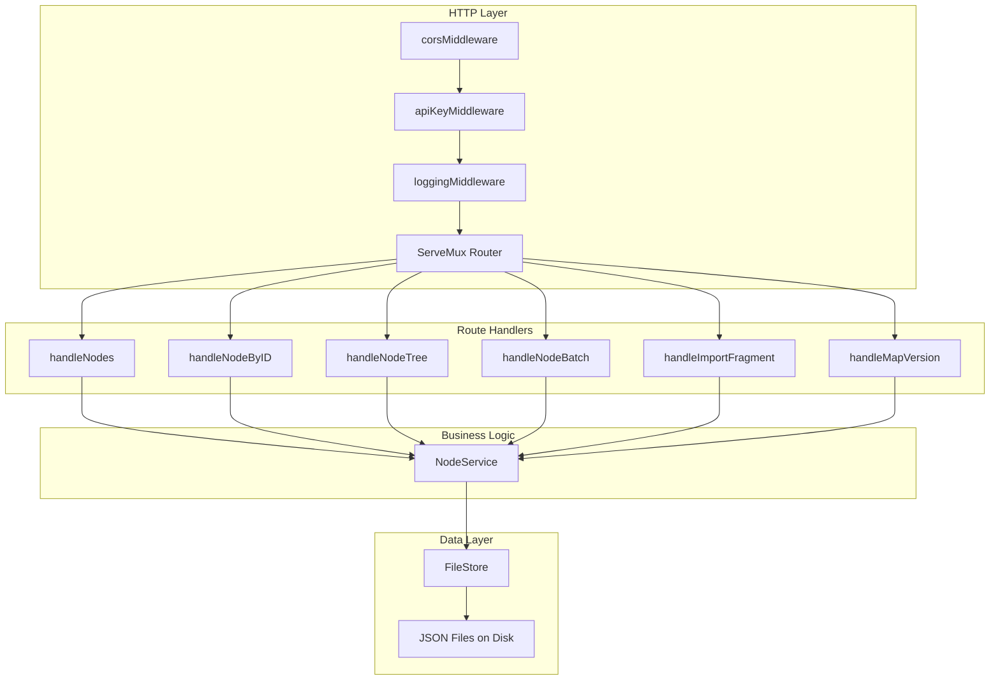

# 设计文档：思维导图 AI 协作策划工具

## 概述

本设计为 Code Mind 应用新增节点级 REST API、API Key 认证中间件、以及 JSON 片段导入与自动补全功能。设计目标是在现有架构（Go HTTP Server + FileStore）上以最小侵入方式扩展，保持与现有 `/api/maps` 端点的一致性。

核心设计决策：
- **路由注册**：在现有 `registerAPI()` 中追加新路由，复用 `handleMapByID` 的 URL 前缀匹配模式
- **认证中间件**：新增 `apiKeyMiddleware`，仅包裹 `/api/maps/` 路径，不影响 `/api/health`
- **线程安全**：所有节点操作通过 FileStore 的 `mu sync.Mutex` 保护，批量操作在单次锁内完成
- **位置计算**：基于父节点现有子节点的最大 Y 坐标 + 96px 垂直间距，X 坐标为父节点 X + 280px

## 架构



### 中间件链

```
Request → corsMiddleware → apiKeyMiddleware → loggingMiddleware → Handler
```

`apiKeyMiddleware` 仅在 `collabApiKey` 非空时生效，对 `/api/health` 路径放行。

## 组件与接口

### 1. 路由注册（server.go 扩展）

在 `registerAPI()` 中新增以下路由：

```go
// Node-level CRUD
mux.HandleFunc("/api/maps/{mapId}/nodes", s.handleNodes)        // GET, POST
mux.HandleFunc("/api/maps/{mapId}/nodes/", s.handleNodeByID)    // GET, PATCH, DELETE
mux.HandleFunc("/api/maps/{mapId}/tree", s.handleNodeTree)      // GET
mux.HandleFunc("/api/maps/{mapId}/batch", s.handleNodeBatch)    // POST
mux.HandleFunc("/api/maps/{mapId}/import-fragment", s.handleImportFragment) // POST
mux.HandleFunc("/api/maps/{mapId}/version", s.handleMapVersion) // GET
```

由于 Go 1.22 之前的 `http.ServeMux` 不支持路径参数，沿用现有模式：通过 `strings.TrimPrefix` 从 URL 路径中提取 `mapId` 和 `nodeId`。

### 2. API Key 认证中间件

```go
// internal/server/auth.go
type APIKeyProvider interface {
    GetCollabAPIKey() string
}

func apiKeyMiddleware(provider APIKeyProvider, next http.Handler) http.Handler
```

**设计决策**：使用接口 `APIKeyProvider` 而非直接读取文件，便于测试和运行时动态更新 key。Server 结构体实现该接口，从内存中的配置读取 key。

**配置存储**：在现有 `data/` 目录下新增 `data/settings.json` 文件存储 `collabApiKey`，与 map 文件分离。前端 localStorage 中的 `AppPreferences` 新增 `collabApiKey` 字段，通过新的 `/api/settings` 端点同步到后端。

### 3. 节点操作处理器

#### handleNodes (GET /api/maps/{mapId}/nodes)

```go
func (s *Server) handleNodes(w http.ResponseWriter, r *http.Request) {
    // 1. 从 URL 提取 mapId
    // 2. 调用 store.Load(mapId)
    // 3. GET: 返回 doc.Nodes 数组
    // 4. POST: 解析请求体，自动补全字段，追加到 doc.Nodes，保存
}
```

#### handleNodeByID (GET/PATCH/DELETE /api/maps/{mapId}/nodes/{nodeId})

```go
func (s *Server) handleNodeByID(w http.ResponseWriter, r *http.Request) {
    // 1. 从 URL 提取 mapId 和 nodeId
    // 2. GET: 返回节点 + 祖先链 + 直接子节点
    // 3. PATCH: 部分更新指定字段
    // 4. DELETE: 根据 cascade 参数删除或重新挂载子节点
}
```

#### handleNodeBatch (POST /api/maps/{mapId}/batch)

```go
type BatchOperation struct {
    Action  string          `json:"action"`  // "create" | "update" | "delete"
    Payload json.RawMessage `json:"payload"`
}

type BatchRequest struct {
    Operations []BatchOperation `json:"operations"`
}
```

**原子性策略**：
1. 加载文档到内存（已在 FileStore mutex 保护下）
2. 在内存副本上依次执行所有操作
3. 任何操作失败则丢弃副本，返回错误
4. 全部成功后一次性写入磁盘

#### handleImportFragment (POST /api/maps/{mapId}/import-fragment)

```go
type FragmentNode struct {
    Title    string         `json:"title"`
    ParentID string         `json:"parentId,omitempty"`
    Note     string         `json:"note,omitempty"`
    Priority string         `json:"priority,omitempty"`
    Color    string         `json:"color,omitempty"`
    Children []FragmentNode `json:"children,omitempty"`
}

type ImportFragmentRequest struct {
    Nodes []FragmentNode `json:"nodes"`
}
```

**递归插入算法**：
1. 对每个顶层 FragmentNode，确定 parentId（默认为 root）
2. 验证 parentId 存在于当前文档中
3. 自动补全 id、kind、position、timestamps
4. 递归处理 children 数组，将父节点设为刚创建的节点 ID
5. 收集所有创建的完整节点作为响应返回

### 4. 位置自动计算

```go
func calculateChildPosition(parent mindmap.Node, siblings []mindmap.Node) mindmap.Position {
    baseX := parent.Position.X + defaultBranchGapX  // 280px
    if len(siblings) == 0 {
        return mindmap.Position{X: baseX, Y: parent.Position.Y}
    }
    // 找到现有子节点中最大的 Y 坐标
    maxY := siblings[0].Position.Y
    for _, s := range siblings {
        if s.Position.Y > maxY {
            maxY = s.Position.Y
        }
    }
    return mindmap.Position{X: baseX, Y: maxY + defaultBranchGapY} // +96px
}
```

**设计决策**：使用 96px 垂直间距（`defaultBranchGapY` 现有值为 100，需求指定 96px，以需求为准）和 280px 水平偏移（与现有 `defaultBranchGapX` 一致）。

### 5. Server 结构体扩展

```go
type Server struct {
    store        *store.FileStore
    httpClient   *http.Client
    collabAPIKey string  // 运行时 API key，从 settings.json 加载
}
```

新增方法：
- `GetCollabAPIKey() string` — 实现 APIKeyProvider 接口
- `LoadSettings()` — 启动时从 `data/settings.json` 加载配置
- `SaveSettings()` — 保存配置到文件

### 6. 版本检测端点

```go
// GET /api/maps/{mapId}/version
type MapVersionResponse struct {
    LastEditedAt time.Time `json:"lastEditedAt"`
    NodeCount    int       `json:"nodeCount"`
}
```

## 数据模型

### 现有模型（无修改）

- `mindmap.Node` — 节点结构，包含 ID、ParentID、Kind、Title、Note、Priority、Color、Position、Timestamps
- `mindmap.Document` — 文档结构，包含 Nodes、Relations、Regions、Meta
- `store.FileStore` — 文件存储，mutex 保护的 JSON 读写

### 新增模型

#### Settings（后端配置）

```go
// internal/store/settings.go
type Settings struct {
    CollabAPIKey string `json:"collabApiKey"`
}
```

存储路径：`data/settings.json`

#### API 请求/响应类型

```go
// 创建节点请求
type CreateNodeRequest struct {
    ParentID string          `json:"parentId"`          // 必填
    Title    string          `json:"title"`             // 必填
    Note     string          `json:"note,omitempty"`
    Kind     mindmap.NodeKind `json:"kind,omitempty"`   // 默认 "topic"
    Priority mindmap.Priority `json:"priority,omitempty"`
    Color    mindmap.NodeColor `json:"color,omitempty"`
}

// 更新节点请求（使用 map 实现部分更新）
type UpdateNodeRequest map[string]interface{}

// 删除节点查询参数
// ?cascade=true (默认) | ?cascade=false

// 批量操作
type BatchOperation struct {
    Action  string          `json:"action"`   // "create" | "update" | "delete"
    NodeID  string          `json:"nodeId,omitempty"`
    Payload json.RawMessage `json:"payload"`
}

// 片段导入
type FragmentNode struct {
    Title    string         `json:"title"`
    ParentID string         `json:"parentId,omitempty"`
    Note     string         `json:"note,omitempty"`
    Priority string         `json:"priority,omitempty"`
    Color    string         `json:"color,omitempty"`
    Children []FragmentNode `json:"children,omitempty"`
}

// GET /nodes/{nodeId} 响应
type NodeDetailResponse struct {
    Node      mindmap.Node   `json:"node"`
    Ancestors []mindmap.Node `json:"ancestors"`
    Children  []mindmap.Node `json:"children"`
}

// GET /tree 响应
type TreeNode struct {
    mindmap.Node
    Children []TreeNode `json:"children"`
}
```

## 正确性属性

*正确性属性是在系统所有有效执行中都应成立的特征或行为——本质上是关于系统应该做什么的形式化陈述。属性是人类可读规范与机器可验证正确性保证之间的桥梁。*

### Property 1: 节点创建自动补全的完整性

*对于任意*有效的创建节点请求（包含 parentId 和 title），创建后返回的节点对象应包含非空的 id（匹配 "node-*" 模式）、有效的 position、非零的 createdAt 和 updatedAt，且 kind 在未指定时默认为 "topic"。

**Validates: Requirements 1.3, 3.1, 3.2, 3.4**

### Property 2: 位置自动计算的单调性

*对于任意*父节点及其现有子节点集合，新创建的子节点的 Y 坐标应等于现有子节点中最大 Y 坐标 + 96px（若无子节点则等于父节点 Y 坐标），X 坐标应等于父节点 X 坐标 + 280px。

**Validates: Requirements 1.8, 3.3**

### Property 3: 部分更新的字段隔离性

*对于任意*节点和任意可更新字段子集（title、note、priority、color、collapsed），PATCH 操作后，仅请求体中包含的字段发生变化，其余字段（包括 id、parentId、kind、position、createdAt）保持不变，且 updatedAt 被更新为当前时间。

**Validates: Requirements 1.4**

### Property 4: 级联删除的完整性

*对于任意*非根节点，当 cascade=true 时，删除该节点后，该节点及其所有后代节点均不再存在于文档中；当 cascade=false 时，删除该节点后，其直接子节点的 parentId 被更新为被删除节点的 parentId。

**Validates: Requirements 1.5**

### Property 5: 批量操作的原子性

*对于任意*包含 N 个操作的批量请求，若其中任何一个操作会导致验证失败，则整个批量请求失败后文档状态与请求前完全一致（无任何操作被应用）。

**Validates: Requirements 1.7**

### Property 6: 树结构端点的完整性

*对于任意*文档，GET /tree 返回的嵌套树结构中，每个节点恰好出现一次，且节点的 children 数组中的每个元素的 parentId 等于该节点的 id，树的根节点为 kind="root" 的节点。

**Validates: Requirements 1.6**

### Property 7: API Key 认证的正确性

*对于任意*已配置的非空 API key 和任意对 `/api/maps/` 路径的请求，当且仅当请求头 `X-API-Key` 的值与配置的 key 完全匹配时，请求被放行；否则返回 HTTP 401。当 API key 为空字符串时，所有请求均被放行。

**Validates: Requirements 2.2, 2.3, 2.4**

### Property 8: 片段导入的树结构保持

*对于任意*有效的片段导入请求（包含嵌套 children 的 FragmentNode 数组），导入后文档中新增的节点数量等于片段中所有节点的总数（递归计算），且每个新节点的 parentId 正确反映片段中描述的父子关系。

**Validates: Requirements 3.5, 3.6, 3.7**

### Property 9: 版本端点的一致性

*对于任意*文档，GET /version 返回的 lastEditedAt 等于文档 Meta.LastEditedAt，nodeCount 等于文档 Nodes 数组的长度。

**Validates: Requirements 2.5**

### Property 10: 输入验证的拒绝正确性

*对于任意*包含无效 kind 值（不在 "root"/"topic"/"floating" 中）的创建请求，或缺少必填字段（parentId 或 title）的创建请求，API 应返回 HTTP 400 且文档状态不变。

**Validates: Requirements 1.10, 1.11**

## 错误处理

### 错误响应格式

沿用现有 `writeError` 函数的格式：

```json
{
  "error": "描述性错误信息"
}
```

### 错误码映射

| 场景 | HTTP 状态码 | 错误信息示例 |
|------|------------|-------------|
| Map 不存在 | 404 | `"map 'xyz' not found"` |
| Node 不存在 | 404 | `"node 'abc' not found in map 'xyz'"` |
| 缺少必填字段 | 400 | `"parentId is required"` |
| 无效 kind 值 | 400 | `"invalid node kind: 'invalid'"` |
| 删除根节点 | 400 | `"cannot delete root node"` |
| 无效 parentId | 400 | `"parent node 'abc' not found in map 'xyz'"` |
| 认证失败 | 401 | `"authentication required: invalid or missing API key"` |
| 批量操作部分失败 | 400 | `"batch operation 3 failed: node 'abc' not found"` |
| 请求体解析失败 | 400 | `"invalid request body: ..."` |

### 错误处理原则

1. **快速失败**：验证在业务逻辑之前执行
2. **描述性错误**：错误信息包含具体的资源 ID 和失败原因
3. **一致性**：所有端点使用相同的 `writeError` 辅助函数
4. **不泄露内部信息**：文件系统路径等内部细节不暴露给客户端

## 测试策略

### 属性测试（Property-Based Testing）

**库选择**：使用 [rapid](https://github.com/flyingmutant/rapid)（Go 语言的 PBT 库）

**配置**：
- 每个属性测试最少运行 100 次迭代
- 每个测试标注对应的设计属性编号
- 标签格式：`Feature: mindmap-ai-collaboration-tool, Property {number}: {property_text}`

**属性测试覆盖**：
- Property 1-10 均实现为属性测试
- 生成器：随机节点标题、随机树结构、随机字段子集、随机 API key

### 单元测试

- 具体边界案例：空标题、超长标题、特殊字符
- 根节点删除拒绝
- 空 API key 的向后兼容
- 位置计算的具体数值验证

### 集成测试

- 完整 HTTP 请求/响应周期
- 并发请求下的 mutex 正确性
- 文件持久化后重新加载的一致性
- 前端 settings 面板与后端配置同步

### 测试文件组织

```
internal/server/
├── node_handlers.go          # 节点 CRUD 处理器
├── node_handlers_test.go     # 单元测试 + 属性测试
├── auth.go                   # 认证中间件
├── auth_test.go              # 认证测试
├── batch.go                  # 批量操作
├── batch_test.go             # 批量操作测试
├── fragment.go               # 片段导入
└── fragment_test.go          # 片段导入测试
```
