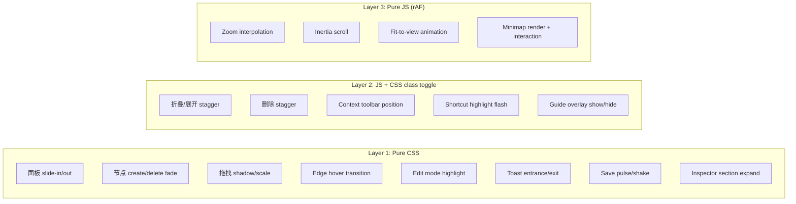

# Design Document: UX 动效与交互体验改进

## Overview

本设计为 Code Mind 桌面应用添加动效与交互体验层，将界面从"好看但不活"提升为"好看且流畅"。设计遵循以下原则：

1. **CSS-first**：能用 CSS transition/keyframes 解决的绝不用 JS
2. **最小侵入**：不重构现有 app.ts 单文件架构，通过新增独立模块 + CSS 扩展实现
3. **渐进增强**：动画失败不影响功能，所有动画可通过 `prefers-reduced-motion` 禁用
4. **性能优先**：仅动画 `transform` 和 `opacity`（GPU 合成层），避免触发 layout/paint

### 技术决策

| 决策 | 选择 | 理由 |
|------|------|------|
| 动画基础设施 | CSS keyframes + transitions | 已有 `--ease: 180ms ease`，扩展即可 |
| JS 动画场景 | requestAnimationFrame 手写 | 仅用于 zoom 插值、惯性滚动、minimap，不引入动画库 |
| 新文件策略 | 2 个新文件：`animations.css` + `ux-engine.ts` | 保持架构简单，不拆分 app.ts |
| 状态管理 | 在 MindMapApp 类上扩展私有字段 | 与现有模式一致 |
| Minimap 渲染 | Canvas 2D（独立小 canvas） | 性能好，不影响主 DOM 树 |

## Architecture

### 整体架构

```mermaid
graph TD
    subgraph "现有架构（不修改）"
        APP[app.ts - MindMapApp class]
        CSS[style.css]
        TYPES[app-types.ts]
    end

    subgraph "新增模块"
        ANIM_CSS[animations.css - 所有新 @keyframes + transitions]
        UX[ux-engine.ts - JS 动画引擎]
    end

    APP -->|调用| UX
    UX -->|requestAnimationFrame| APP
    ANIM_CSS -->|@import| CSS
    APP -->|添加/移除 CSS class| ANIM_CSS
```

### 动画分层



## Components and Interfaces

### 1. animations.css — CSS 动画定义

新增独立 CSS 文件，通过 `@import` 引入 `style.css`。包含所有新 `@keyframes` 和扩展的 `transition` 规则。

```css
/* 文件结构概览 */
/* === Panel Animations === */
/* === Node Lifecycle === */
/* === Drag Feedback === */
/* === Edge Interactions === */
/* === Edit Mode === */
/* === Feedback (Toast, Save, Shortcut) === */
/* === Guide & Overlay === */
/* === Inspector Sections === */
/* === Context Toolbar === */
/* === Minimap === */
/* === Reduced Motion === */
```

### 2. UxEngine class (ux-engine.ts)

独立模块，负责所有需要 JS 驱动的动画逻辑。MindMapApp 持有一个 UxEngine 实例。

```typescript
export interface ViewportState {
  x: number
  y: number
  scale: number
}

export interface InertiaState {
  active: boolean
  velocityX: number
  velocityY: number
  friction: number
  rafId: number | null
}

export interface ZoomAnimState {
  active: boolean
  startScale: number
  targetScale: number
  centerX: number
  centerY: number
  startTime: number
  duration: number
  rafId: number | null
}

export interface FitViewAnimState {
  active: boolean
  startViewport: ViewportState
  targetViewport: ViewportState
  startTime: number
  duration: number
  rafId: number | null
}

export type ViewportUpdateCallback = (viewport: ViewportState) => void

export class UxEngine {
  private inertia: InertiaState
  private zoomAnim: ZoomAnimState
  private fitViewAnim: FitViewAnimState
  private onViewportUpdate: ViewportUpdateCallback

  constructor(onViewportUpdate: ViewportUpdateCallback)

  // Zoom interpolation
  animateZoom(currentScale: number, targetScale: number, centerX: number, centerY: number, viewportX: number, viewportY: number): void
  cancelZoom(): void

  // Inertia scrolling
  startInertia(velocityX: number, velocityY: number, currentViewport: ViewportState): void
  cancelInertia(): void

  // Fit-to-view
  animateFitToView(current: ViewportState, target: ViewportState): void
  cancelFitToView(): void

  // Stagger helpers
  computeStaggerDelays(nodeIds: string[], baseDelay: number): Map<string, number>

  // Alignment detection
  detectAlignment(draggedPos: Position, draggedSize: Size, otherNodes: NodeBounds[]): AlignmentGuide[]

  // Cleanup
  destroy(): void
}

export interface Position { x: number; y: number }
export interface Size { width: number; height: number }
export interface NodeBounds { id: string; x: number; y: number; width: number; height: number }

export interface AlignmentGuide {
  axis: 'x' | 'y'
  position: number  // screen coordinate of the guide line
  type: 'center' | 'edge'
}
```

### 3. Minimap Component

嵌入在 MindMapApp 中的轻量 Canvas 2D 组件。

```typescript
export interface MinimapConfig {
  width: number   // 180
  height: number  // 120
  opacity: number // 0.85
  hoverOpacity: number // 0.85
  idleOpacity: number  // 0.4
}

export interface MinimapState {
  canvas: HTMLCanvasElement
  ctx: CanvasRenderingContext2D
  visible: boolean
  hovered: boolean
  dragging: boolean
}
```

### 4. Context Toolbar

浮动工具条，选中单节点时显示在节点上方。

```typescript
export interface ContextToolbarState {
  visible: boolean
  nodeId: string | null
  position: Position  // 计算后的屏幕坐标
  element: HTMLElement | null
}
```

### 5. Toast Queue Manager

管理 toast 通知的队列和堆叠。

```typescript
export interface ToastItem {
  id: string
  message: string
  createdAt: number
  element: HTMLElement | null
}

export interface ToastManagerState {
  queue: ToastItem[]
  maxVisible: number  // 3
  autoDismissMs: number  // 2500
  spacing: number  // 8px
}
```

### 6. Guide Overlay

空画布引导和快捷键覆盖层。

```typescript
export interface GuideOverlayState {
  canvasGuideVisible: boolean
  canvasGuideDismissed: boolean  // session-level flag
  shortcutOverlayVisible: boolean
}
```

## Data Models

### 扩展 AppState（在 app-types.ts 中添加）

```typescript
// 新增到 AppState interface
export interface AppState {
  // ... existing fields ...

  // UX Polish additions
  contextToolbar: ContextToolbarState
  toastQueue: ToastItem[]
  guideOverlay: GuideOverlayState
  panelAnimating: Set<string>  // panel IDs currently animating
}
```

### 扩展 MindMapApp 私有字段

```typescript
// 新增到 MindMapApp class
private uxEngine: UxEngine
private minimapState: MinimapState | null = null
private minimapConfig: MinimapConfig = { width: 180, height: 120, opacity: 0.85, hoverOpacity: 0.85, idleOpacity: 0.4 }
```

### CSS Custom Properties 扩展

```css
:root {
  /* 现有 */
  --ease: 180ms ease;

  /* 新增动画变量 */
  --ease-out: cubic-bezier(0.33, 1, 0.68, 1);
  --ease-in-out: cubic-bezier(0.65, 0, 0.35, 1);
  --duration-fast: 150ms;
  --duration-normal: 250ms;
  --duration-slow: 350ms;
  --stagger-base: 40ms;
}
```

## Correctness Properties

*A property is a characteristic or behavior that should hold true across all valid executions of a system—essentially, a formal statement about what the system should do. Properties serve as the bridge between human-readable specifications and machine-verifiable correctness guarantees.*

### Property 1: Panel animation mutual exclusion

*For any* panel and any sequence of rapid open/close triggers, at most one animation (open or close) SHALL be active on that panel at any given time. A new trigger received while an animation is in progress SHALL be ignored until the current animation completes.

**Validates: Requirements 1.3**

### Property 2: Node deletion DOM retention during animation

*For any* node being deleted, the DOM element SHALL remain in the document for the full duration of the removal animation (150ms–250ms) before being removed from the DOM tree.

**Validates: Requirements 3.1**

### Property 3: Subtree deletion stagger ordering

*For any* subtree of N nodes, the deletion stagger delay for the i-th node (in depth-first order) SHALL equal `i * staggerDelay` where `staggerDelay` is a constant in [30, 50]ms. The total animation duration SHALL equal `(N-1) * staggerDelay + baseAnimationDuration`.

**Validates: Requirements 3.2**

### Property 4: Alignment guide detection threshold

*For any* dragged node position and any other node on the canvas, an alignment guide line SHALL appear if and only if the absolute difference between their centers (or edges) on either axis is less than or equal to 5 pixels.

**Validates: Requirements 5.2**

### Property 5: Drop target highlight distance threshold

*For any* dragged node position and any potential parent node, the target node's border SHALL be highlighted with accent color if and only if the Euclidean distance between the dragged node's center and the target node's center is less than or equal to 40 pixels.

**Validates: Requirements 5.3**

### Property 6: Zoom interpolation correctness

*For any* start scale `s0`, target scale `s1`, and normalized time `t ∈ [0, 1]`, the interpolated scale SHALL equal `s0 + (s1 - s0) * easeOutCubic(t)` where `easeOutCubic(t) = 1 - (1 - t)³`.

**Validates: Requirements 6.1**

### Property 7: Zoom center point invariant

*For any* zoom operation with center point `(cx, cy)` in screen space, the world-space coordinate at `(cx, cy)` SHALL remain constant throughout the entire zoom interpolation. Formally: `worldPoint(cx, cy, viewport_t) = worldPoint(cx, cy, viewport_0)` for all `t ∈ [0, 1]`.

**Validates: Requirements 6.2**

### Property 8: Zoom retarget continuity

*For any* in-progress zoom animation at time `t` with current interpolated scale `s_current`, a new zoom target `s_new` SHALL start interpolation from `s_current` (not from the original `s0`). The resulting scale function SHALL be continuous (no jumps).

**Validates: Requirements 6.3**

### Property 9: Inertia physics model

*For any* initial velocity `v0 > 50px/s` and friction coefficient `f ∈ [0.92, 0.96]`, the velocity at frame N SHALL equal `v0 * f^N`, AND the animation SHALL stop at the first frame where `|velocity| < 0.5px/frame`.

**Validates: Requirements 7.1, 7.2**

### Property 10: Fit-to-view viewport bounds

*For any* set of visible node bounding boxes, the computed fit-to-view target viewport SHALL contain all nodes such that every node's bounding box has at least 60px of padding from each edge of the viewport.

**Validates: Requirements 8.2**

### Property 11: Minimap viewport rectangle proportionality

*For any* viewport state `(x, y, scale)` and canvas bounds `(width, height)`, the minimap viewport rectangle's position and size SHALL be proportional: `minimapRect.x / minimapWidth = viewportVisibleArea.x / canvasWidth` (and similarly for y, width, height).

**Validates: Requirements 9.2**

### Property 12: Minimap click-to-pan coordinate mapping

*For any* click position `(mx, my)` within the minimap bounds, the resulting canvas pan SHALL center the viewport on the world position `(mx / minimapWidth * canvasWidth, my / minimapHeight * canvasHeight)`.

**Validates: Requirements 9.3**

### Property 13: Guide overlay visibility condition

*For any* document state, the canvas guide overlay SHALL be visible if and only if: the document contains exactly one root node with zero children AND the guide has not been dismissed in the current session.

**Validates: Requirements 12.1**

### Property 14: Toast queue maximum visibility

*For any* number of simultaneously queued toast notifications, at most 3 SHALL be visible at any time. Toasts beyond the limit SHALL wait in queue until a visible slot becomes available.

**Validates: Requirements 15.4**

### Property 15: Shortcut-to-toolbar highlight mapping

*For any* keyboard shortcut that has a corresponding toolbar button, activating the shortcut SHALL trigger a highlight animation on that button. The mapping SHALL be bijective: each shortcut maps to exactly one button.

**Validates: Requirements 16.1**

### Property 16: Context toolbar non-overlap positioning

*For any* selected node with position `(x, y)` and dimensions `(w, h)`, the context toolbar SHALL be positioned such that `toolbar.bottom <= node.top` (the toolbar's bottom edge does not exceed the node's top edge), ensuring no visual overlap with node content.

**Validates: Requirements 17.5**

### Property 17: Toast on destructive operations

*For any* destructive operation (delete, batch delete, paste), the system SHALL create exactly one toast notification containing a description of the operation performed.

**Validates: Requirements 15.1**

## Error Handling

### 动画失败降级

| 场景 | 处理方式 |
|------|----------|
| CSS animation 不支持 | 功能正常，无动画（graceful degradation） |
| rAF 回调异常 | try-catch 包裹，cancelAnimationFrame 清理，回退到目标状态 |
| Minimap canvas 创建失败 | 隐藏 minimap，不影响主功能 |
| Toast 队列溢出 | 丢弃最旧的 toast，保持最新 3 条 |
| 面板动画中断（如窗口失焦） | animationend/transitionend 超时兜底（duration + 50ms），强制完成状态切换 |

### prefers-reduced-motion 支持

```css
@media (prefers-reduced-motion: reduce) {
  *, *::before, *::after {
    animation-duration: 0.01ms !important;
    animation-iteration-count: 1 !important;
    transition-duration: 0.01ms !important;
  }
}
```

当检测到 `prefers-reduced-motion: reduce` 时：
- CSS 动画自动降级为瞬间完成
- JS 动画（UxEngine）跳过插值，直接设置目标值
- Minimap 仍然渲染，但不做 fade 动画

### 性能保护

- 所有 rAF 动画在 `document.hidden` 时暂停
- Minimap 渲染使用 throttle（最多 60fps，空闲时降至 10fps）
- 对齐辅助线检测使用空间索引（当节点 > 100 时启用简化算法）
- Toast 动画使用 `will-change: transform, opacity` 提示浏览器

## Testing Strategy

### 单元测试（Vitest）

针对纯函数逻辑的 example-based 测试：

| 模块 | 测试内容 |
|------|----------|
| UxEngine.easeOutCubic | 边界值 t=0, t=1, t=0.5 |
| UxEngine.computeStaggerDelays | 空数组、单节点、多节点树 |
| UxEngine.detectAlignment | 对齐/不对齐的具体案例 |
| Minimap coordinate mapping | 具体坐标转换案例 |
| Toast queue management | 添加/移除/溢出场景 |
| Guide overlay visibility logic | 各种文档状态 |
| Context toolbar positioning | 节点在边缘的情况 |

### 属性测试（Vitest + fast-check）

针对 Correctness Properties 中定义的 17 个属性，使用 `fast-check` 库进行 property-based testing：

- 每个属性测试最少运行 **100 次迭代**
- 每个测试用注释标注对应的设计属性：
  ```typescript
  // Feature: ux-polish, Property 6: Zoom interpolation correctness
  ```
- Tag 格式：**Feature: ux-polish, Property {number}: {property_text}**

重点 PBT 覆盖：
1. 缩放插值数学正确性（Property 6, 7, 8）
2. 惯性物理模型（Property 9）
3. Fit-to-view 边界计算（Property 10）
4. Minimap 坐标映射（Property 11, 12）
5. 对齐检测阈值（Property 4, 5）
6. Toast 队列约束（Property 14, 17）
7. Context toolbar 定位约束（Property 16）

### 集成测试

- 面板动画互斥（Property 1）：模拟快速点击，验证状态锁
- 节点删除 DOM 保留（Property 2）：创建节点、删除、检查 DOM 存在时间
- Guide overlay 条件（Property 13）：各种文档状态下的显示/隐藏

### 不适用 PBT 的部分

以下使用 example-based 测试：
- CSS 动画时长/缓动函数值（静态值验证）
- DOM 结构正确性（快照测试）
- 视觉效果（人工验收）
